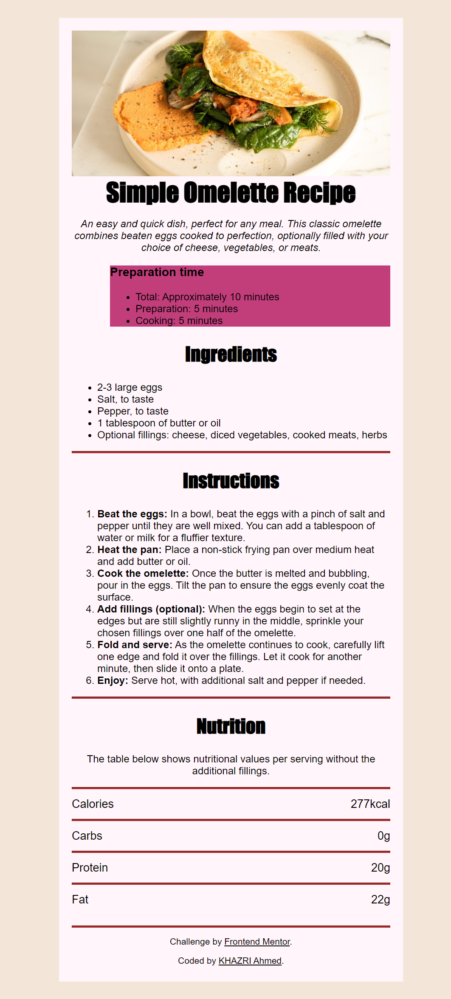
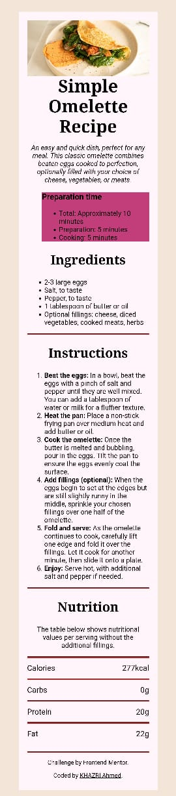

test# Frontend Mentor - Recipe page solution

This is a solution to the [Recipe page challenge on Frontend Mentor](https://www.frontendmentor.io/challenges/recipe-page-KiTsR8QQKm). Frontend Mentor challenges help you improve your coding skills by building realistic projects. 

## Table of contents

- [Overview](#overview)
  - [The challenge](#the-challenge)
  - [Screenshot](#screenshot)
  - [Links](#links)
- [My process](#my-process)
  - [Built with](#built-with)
- [Author](#author)

## Overview
in this challenge i used HTML and CSS.
### Screenshot
Desktop screenshot

Mobile screenshot

### Links

- Solution URL: 
- Live Site URL: 

## My process

### Built with

- Semantic HTML5 markup
- CSS custom properties
- desktop-first workflow

## Author

- Frontend Mentor - [@AhmedKhazri](https://www.frontendmentor.io/profile/AhmedKhazri)
- Twitter - [@ahmed95khazri](https://twitter.com/ahmed95khazri)

